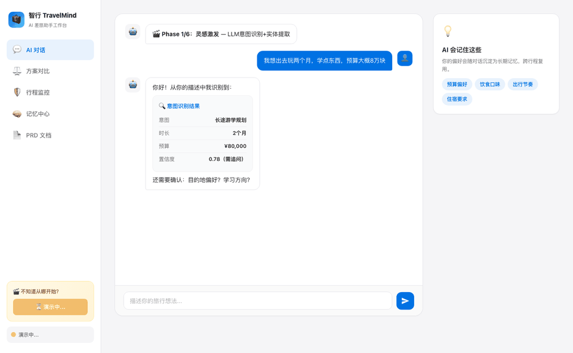

# CSTS TravelChat — 您的AI 差旅助手

> **现状说明**：本仓库当前是「前端交互原型 + 携程问道（TripAI）代理」，所有旅行数据均来自携程官方「问道」接口（`wendao-skill-prod.ctrip.com/skill/query`）。
> - **对话**：自由输入经 `server.js` 代理调用携程问道，返回真实酒店 / 机票 / 火车票 / 景点 / 玩乐答案。
> - **方案对比**：输入两个目的地 + 选择侧重点，由携程问道实时双栏对比并生成综合建议（真实数据）。
> - **行程监控**：顶部「实时查询」框可查真实航班 / 天气 / 突发信息；下方时间线、Plan B 与编排链为产品演示示意。
> - **记忆中心**：长期记忆**持久化**在本机浏览器（localStorage），可手动增删/锁定，聊天中提取的偏好也会自动归入。
> - **PRD**：静态产品文档，无外部数据。
> - 原始技能协议来自 [trips-ai/tripai-skill](https://github.com/trips-ai/tripai-skill)。

---

## 快速启动

```bash
# 1. 安装依赖（仅需一次）
npm install

# 2. 启动（同时托管前端 + /api/ctrip 代理）
npm start            # 默认端口 6001
# 或自定义端口：
PORT=8080 npm start

# 3. 浏览器打开
open http://localhost:6001
```

> 依赖 Node.js 18+（使用内置 fetch）。无需 Python。

### 可选：配置携程问道 API Key

不配置也能用（接口未鉴权时可用，但可能限流）。如需稳定服务，到
[www.ctrip.com/wendao/openclaw](https://www.ctrip.com/wendao/openclaw) 申请 Key，二选一：

```bash
# 方式 A：环境变量
export TRIPAI_API_KEY="your_api_key"

# 方式 B：配置文件（与 tripai-skill 约定一致）
mkdir -p ~/.config/tripai-skill
echo "your_api_key" > ~/.config/tripai-skill/api_key
```


### 演示动图



### 停止项目
如果你是在启动服务的终端里运行的本地服务器，直接按下 `Ctrl + C` 即可停止。

如果需要手动结束占用端口的进程，可执行：

```bash
# 查看 8765 端口占用
lsof -i :8765

# 结束对应 PID
kill -9 <PID>
```

如果你想一次性查看并结束所有与 Node/Python 相关的本地服务，也可以使用：

```bash
killall node
killall python3
```

---

## 项目结构

```
LvxingTuijianChat/
├── README.md                          # 说明文档
├── server.js                          # Express：托管前端 + /api/ctrip 代理到携程问道
├── package.json                       # 依赖与启动脚本
├── assets/
│   └── demo-phases.gif                # 演示动图
└── prototype/
    ├── index.html                     # 交互原型（5 个视图）
    ├── styles.css                     # 样式（白色主题）
    ├── app.js                         # 交互逻辑（聊天走 /api/ctrip，其余为原型）
    └── system-flow.html               # 系统流程图（7 张 SVG）
```

---

## 原型功能

打开后左侧导航切换 5 个视图：

| 视图 | 说明 |
|------|------|
| 💬 AI 对话 | 核心入口。输入旅行想法触发三场景智能对话，AI 气泡内嵌结构化卡片 |
| ⚖️ 方案对比 | 6 维度评分 + 进度条 + 3 权重滑块实时重算 + 证据链 |
| 🛡️ 行程监控 | 系统主动监控面板 + 时间线 + Plan B 选择 + 4 步 MCP 编排链动画 |
| 🧠 记忆中心 | 长期/短期记忆展示 + 编辑/锁定/过期 + 治理规则 |
| 📄 PRD 文档 | 内嵌完整 PRD（定位→竞品→场景→AI 逻辑→功能路线→设计阐述） |

## 快速体验

- **聊天框输入**：`欧洲游学` / `新疆云南对比` / `突发暴雨` 触发对应场景
- **🎬 演示按钮**：左侧边栏底部，自动走完 6 个 Phase 完整演示
- **系统流程图**：打开 `http://127.0.0.1:8765/system-flow.html` 查看 7 张架构图


## 系统流程图

`system-flow.html` 包含 7 张 SVG：

1. 系统整体架构（四层）
2. AI 核心数据流水线（6 阶段）
3. 记忆生命周期管理
4. 三大场景用户旅程
5. MCP 协议架构
6. Agent Skill 目录（10 个 Skill）
7. 竞品格局（四类参考 & 差异化定位）
